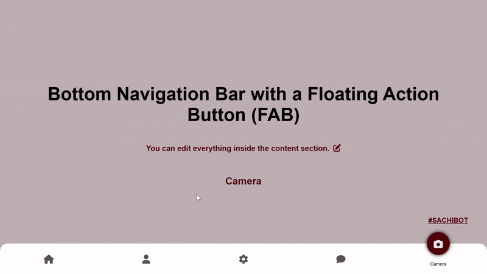

# BottomNav + FloatingButton

An animated, mobile-inspired bottom navigation bar with a floating action button (FAB) effect. This component is built using HTML, CSS, and vanilla JavaScript. Perfect for responsive web apps, PWAs, or mobile-first designs.



> 💡 The above preview is a GIF and loops automatically to demonstrate the animation.

---

## 🚀 Features

- Smooth floating indicator animation
- Fully customizable tab icons and labels
- Responsive and mobile-friendly design
- Easily extendable (add/remove tabs)
- Pure HTML, CSS & JS (no framework dependency)

---

## 📦 How to Use

### 1. Include in Your Project

#### ✅ HTML

```html
<!-- Navigation Container -->
<section class="bottom-nav" id="bottomNav"></section>

<!-- Content Section -->
<section class="content">
  <!-- Add your content here -->
</section>
```

#### ✅ CSS

Create a new file `style.css` and add the provided CSS there. Then link it in your `<head>`:

```html
<link rel="stylesheet" href="style.css" />
```

#### ✅ JavaScript

Create a new file `script.js` and add the JavaScript logic. Then link it before the closing `</body>` tag:

```html
<script src="script.js"></script>
```

---

## 🛠️ Customization

You can customize tabs easily via the `navItems` array in `script.js`:

```js
const navItems = [
  { icon: '<i class="fas fa-home"></i>', label: "Home" },
  { icon: '<i class="fas fa-user"></i>', label: "Profile" },
  { icon: '<i class="fas fa-cog"></i>', label: "Settings" },
  { icon: '<i class="fas fa-comment"></i>', label: "Chat" },
  { icon: '<i class="fas fa-camera"></i>', label: "Camera" },
];
```

- Add or remove items as needed
- Icons use [Font Awesome](https://fontawesome.com/) (v6)

--- 
 
## 📄 License

Feel free to use and modify this project in your personal or commercial projects.

---

Made with ❤️ by [@SACHIBOT](https://github.com/Sachinthafdo)